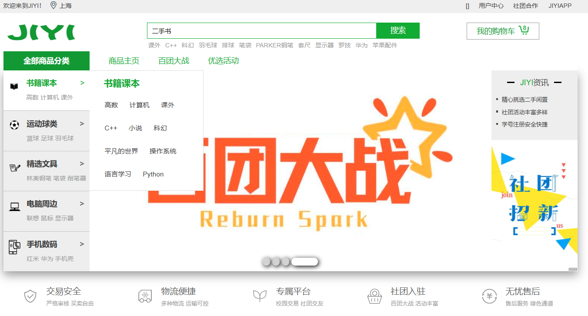
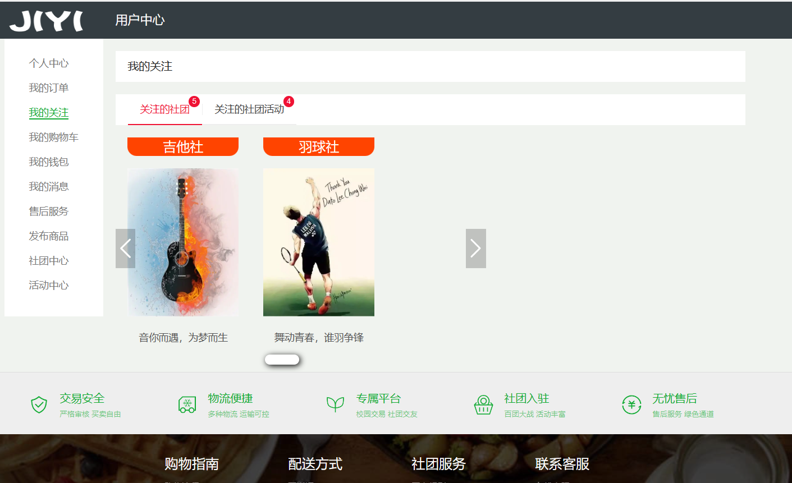
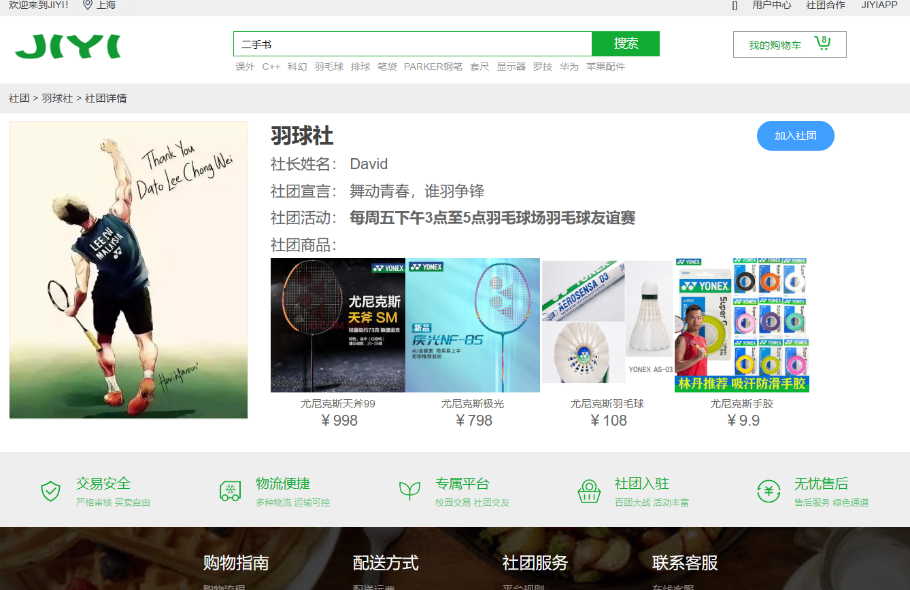

Under the guidance of [Prof. Yuan](https://sse.tongji.edu.cn/info/1092/3135.htm), we built a campus platform that 
combines second-hand trading and club management using the Vue.js and Spring Boot frameworks.

You can see this project here: [Git](https://github.com/Sea-173/JIYI).

# Gists
- Developed the front-end webpage using the Vue framework.
- Conducted back-end development using the Spring Boot framework.
- Performed database management using MySQL.

# Introduction
We plan to introduce a new approach to club management through the JIYI platform. The platform offers ample space for clubs to publish promotional content, event information, and product details, while also providing individuals with the opportunity to sell their second-hand items.
As a club management system, it will include features for managing club activities, club members, a club forum, and club showcases. All students will have the freedom to access information about clubs and their activities. With the aim of fostering social connections, students can participate in discussions and add friends on the forum. Clubs can join the system to organize activities and showcase their offerings.
Furthermore, club members will have the convenience of purchasing affordable club products from the club's homepage and can also list their own items for sale. Addressing the challenges of current second-hand transactions, our platform will provide post-sale service guarantees.

# Screenshots

