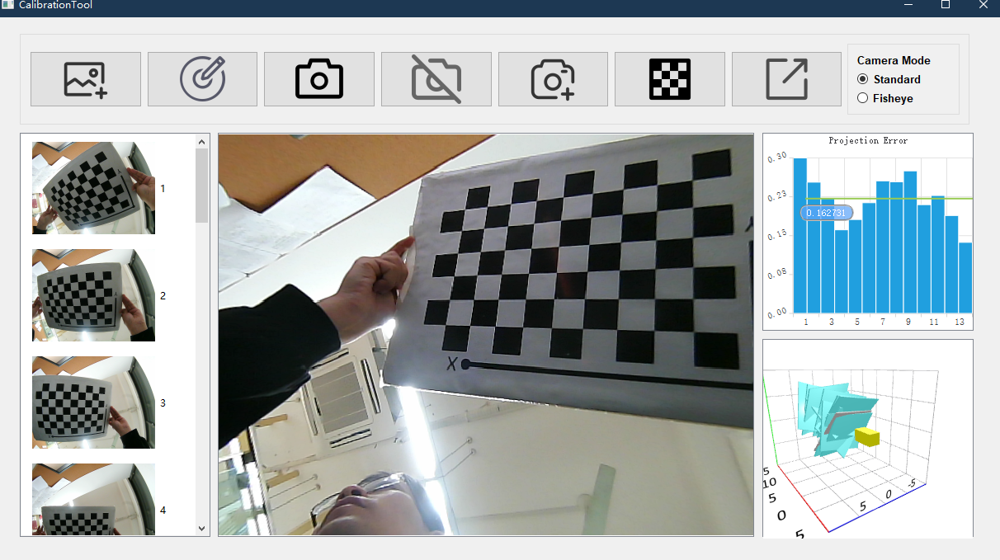
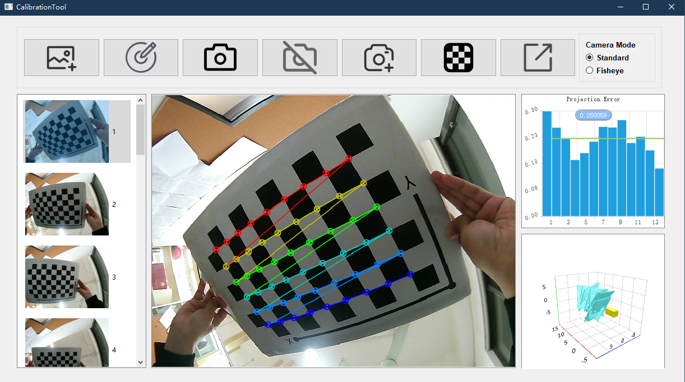

Under the guidance of [Prof. Zhang](https://cslinzhang.gitee.io/home/), we successfully utilized OpenCV and 
Qt to implement a small
tool that has similar functionality to MATLAB's camera calibration tool.

You can see this project here: [Git](https://github.com/Qfccse/CalibrationTool).

# Gists
- Built a user-friendly visual interface using Qt.
- Implemented camera calibration functionality using C++ and OpenCV library functions.

# Introduction

With the help of OpenCV and Qt, we successfully implemented a small 
tool that has similar functionality to MATLAB's camera calibration tool.

This tool is developed by emulating the camera calibration tool in the MATLAB toolbox, offering comprehensive camera calibration functionalities, including distortion coefficient determination and intrinsic parameter estimation. The tool can display real-time histograms representing projection error, 3D graphs illustrating the relative positioning of the camera and images, and it can also perform real-time photograph calibration.

Users input five or more images with black and white checkerboard patterns, and the tool can calculate the camera's distortion coefficients and intrinsic parameters, thereby accomplishing image distortion correction.

# Screenshots

