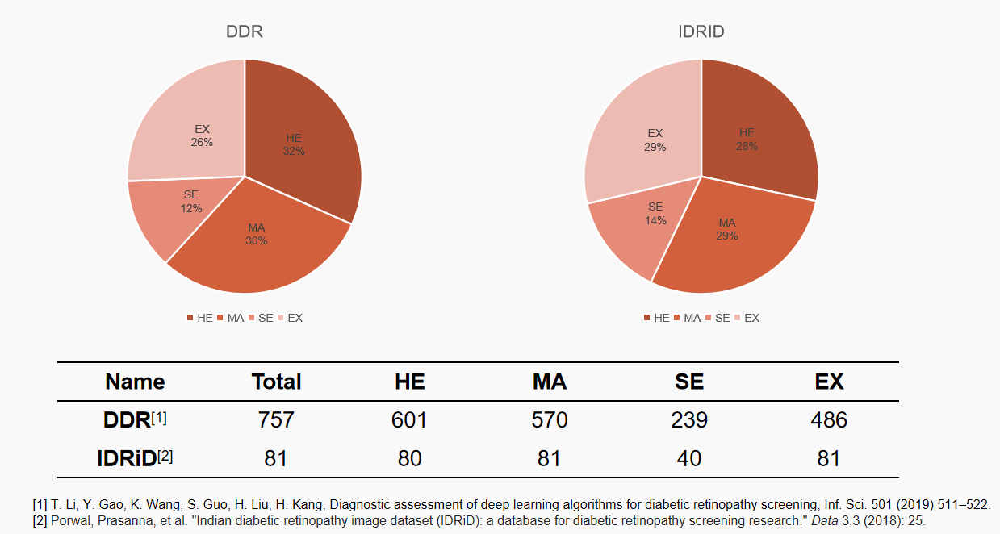
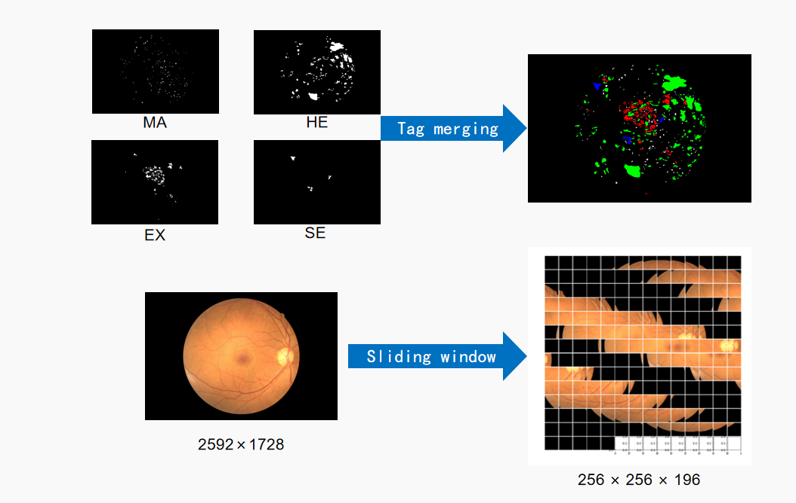
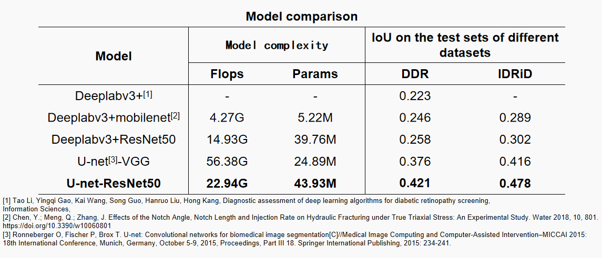
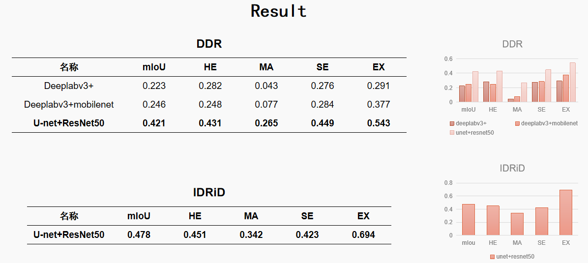
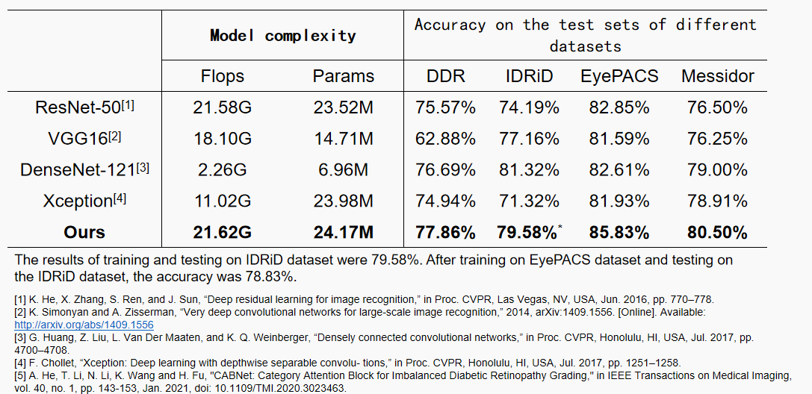
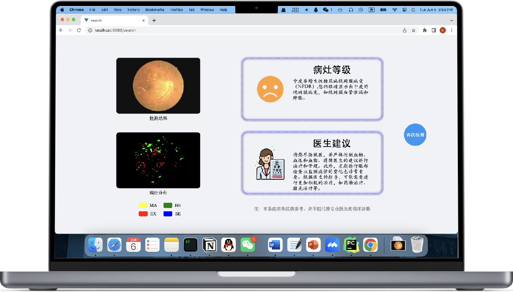

Under the guidance of [Prof. Zhang](https://sse.tongji.edu.cn/info/1092/1162.htm), we conducted 
experiments on both diabetic retinopathy segmentation and grading using publicly available datasets. Finally, we 
successfully developed a website that can provide intelligent recommendations based on lesion segmentation and 
grading.   

# Gists
- Conducted filtering, cleaning, and other preprocessing on the DDR dataset.
- Built a Unet+ResNet50 model and completed the diabetic retinopathy classification task.
- Built a BiRA-Net model and accomplished the diabetic retinopathy grading task.

# Introduction

## Segmentation

### Preprocessing
First, we selected two datasets: [DDR](https://www.sciencedirect.com/science/article/pii/S0020025519305377?__cf_chl_tk=dXFutW_Eavy9Fz1M37lFt2IEXuFtiniV2uv.su63dCw-1692599234-0-gaNycGzNDtA), [IDRiD](https://www.sciencedirect.com/science/article/pii/S1361841519301033). Regarding diabetic 
retinopathy segmentation, we selected two datasets and conducted preprocessing initially.

### Result
We trained and tested using multiple models, and ultimately found that the U-net-ResNet50 model yielded the best results.

## Grading
Consistent with the above, we tested multiple models on various datasets and obtained the final results.

## Website
We have developed a website that can provide intelligent recommendations based on lesion segmentation and grading.

